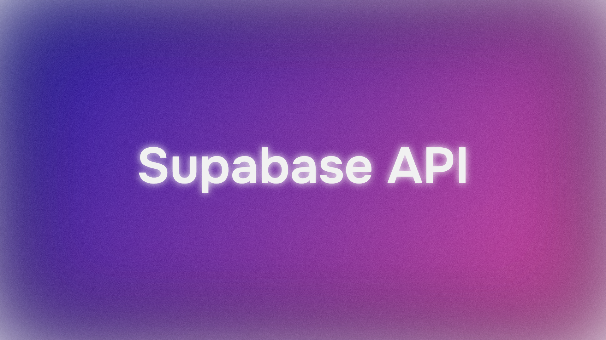

# Mastering the Supabase API: A Complete Guide

Supabase has emerged as a robust open-source alternative to Firebase, equipping developers with a powerful toolkit centered around PostgreSQL. Its core strength lies in providing an instant, real-time API for your database, streamlining backend development. This guide offers a detailed walkthrough of the Supabase API, covering setup, core operations, security practices, customization, and type-safe development.

## 1. Overview: What is the Supabase API?

Unlike traditional backend development, which often involves crafting REST or GraphQL endpoints from scratch, Supabase automatically generates secure, high-performance APIs. By creating a table in your Supabase PostgreSQL database, the platform leverages PostgREST to analyze your schema and produce corresponding RESTful endpoints.

### Key Advantages

- **Instant Backend**: Functional API endpoints are available as soon as you define your database schema.
- **Real-Time Features**: Subscribe to database updates via WebSockets for dynamic applications.
- **PostgreSQL Foundation**: Harness the reliability, flexibility, and advanced features of PostgreSQL, such as Row-Level Security (RLS).
- **Multiple Access Methods**: Interact through REST, GraphQL (via community support), or Supabase client libraries (JavaScript, Python, Dart, etc.).
- **Scalability**: Extend functionality with custom serverless Edge Functions for complex logic or integrations.

This guide emphasizes the REST API, client library interactions, and Supabase Edge Functions.

## 2. Getting Started with the Supabase API

To grasp the Supabase API, let’s jump in. Assume you’ve created a Supabase project (if not, head to [supabase.com](https://supabase.com) to set one up for free) and built a basic table, such as `users`:

```sql
-- Create a table for user profiles
create table users (
  id uuid references auth.users not null primary key,
  updated_at timestamp with time zone,
  username text unique,
  avatar_url text,
  website text,

  constraint username_min_length check (char_length(username) >= 3)
);

-- Enable Row-Level Security (RLS)
-- See https://supabase.com/docs/guides/auth/row-level-security for more details
alter table users
  enable row level security;

create policy "Public profiles are visible to all" on users
  for select using (true);

create policy "Users can create their own profile" on users
  for insert with check (auth.uid() = id);

create policy "Users can modify their own profile" on users
  for update using (auth.uid() = id);

-- Trigger to auto-create a profile on user signup via Supabase Auth
-- See https://supabase.com/docs/guides/auth/managing-user-data#using-triggers
create function public.handle_new_user()
returns trigger as $$
begin
  insert into public.users (id, username)
  values (new.id, new.raw_user_meta_data->>'username');
  return new;
end;
$$ language plpgsql security definer;
create trigger on_auth_user_created
  after insert on auth.users
  for each row execute procedure public.handle_new_user();
```

(Note: This example uses a `users` table, but the principles apply to any table, like `tasks` or custom ones you create.)

### Locating Your API Credentials

Every Supabase project includes unique API credentials:

1. **Project URL**: Your dedicated Supabase endpoint (e.g., `https://<your-project-ref>.supabase.co`).
2. **API Keys**: Available in your Supabase Project Dashboard under `Project Settings` > `API`.
   - `anon` (public): Safe for client-side use (browsers, mobile apps), relying on RLS for data protection.
   - `service_role` key: A secret key with full admin access, bypassing RLS. Use only in secure server environments and never expose it client-side.

### Using the API with the Supabase JS Client Library

Supabase offers client libraries to simplify API interactions. Here’s an example using the JavaScript library (`supabase-js`):

```javascript
// 1. Import and initialize the client
import { createClient } from '@supabase/supabase-js'

const supabaseUrl = 'https://<your-project-ref>.supabase.co'
const supabaseAnonKey = '<your-anon-key>'

const supabase = createClient(supabaseUrl, supabaseAnonKey)

// 2. Retrieve data (SELECT *)
async function fetchUsers() {
  const { data, error } = await supabase
    .from('users')
    .select('*')

  if (error) console.error('Error retrieving users:', error)
  else console.log('Users:', data)
}

// 3. Add data (INSERT)
async function addUser(userId, username) {
  const { data, error } = await supabase
    .from('users')
    .insert([
      { id: userId, username: username, updated_at: new Date() },
    ])
    .select() // Return inserted data

  if (error) console.error('Error adding user:', error)
  else console.log('User added:', data)
}

// 4. Modify data (UPDATE)
async function updateUserName(userId, newUsername) {
  const { data, error } = await supabase
    .from('users')
    .update({ username: newUsername, updated_at: new Date() })
    .eq('id', userId) // Update where id matches
    .select()

  if (error) console.error('Error updating user:', error)
  else console.log('User updated:', data)
}

// 5. Remove data (DELETE)
async function removeUser(userId) {
  const { data, error } = await supabase
    .from('users')
    .delete()
    .eq('id', userId) // Delete where id matches

  if (error) console.error('Error removing user:', error)
  else console.log('User removed successfully')
}

// Example usage (assuming a user ID)
// fetchUsers();
// addUser('some-uuid-v4', 'new_user');
// updateUserName('some-uuid-v4', 'updated_username');
// removeUser('some-uuid-v4');
```

This code demonstrates core CRUD operations (Create, Read, Update, Delete) using the client library, which interacts with the REST API under the hood.

## 3. Understanding the Supabase REST API

While client libraries are user-friendly, it’s crucial to understand the auto-generated REST API powered by PostgREST.

### API Endpoint Structure

The base URL for the REST API is: `https://<your-project-ref>.supabase.co/rest/v1/`

Generated endpoints for your tables include:

- `GET /rest/v1/your_table_name`: Retrieve rows from the table.
- `POST /rest/v1/your_table_name`: Insert new rows.
- `PATCH /rest/v1/your_table_name`: Update existing rows.
- `DELETE /rest/v1/your_table_name`: Delete rows.

### Authentication

API requests require your API key in the `apikey` header and often an `Authorization` header with `Bearer <your-api-key>` (typically the `anon` key for client-side or `service_role` key for server-side).

```
apikey: <your-anon-or-service-role-key>
Authorization: Bearer <your-anon-or-service-role-key>
```

### Common Operations (Using `curl` Examples)

Here’s how to perform the earlier operations using `curl` against the REST API. Replace placeholders as needed.

**Retrieve Data (GET):**

```bash
curl 'https://<ref>.supabase.co/rest/v1/users?select=*' \
  -H "apikey: <anon-key>" \
  -H "Authorization: Bearer <anon-key>"
```

**Insert Data (POST):**

```bash
curl 'https://<ref>.supabase.co/rest/v1/users' \
  -X POST \
  -H "apikey: <anon-key>" \
  -H "Authorization: Bearer <anon-key>" \
  -H "Content-Type: application/json" \
  -H "Prefer: return=representation" \
  -d '{ "id": "some-uuid", "username": "api_user" }'
```

**Update Data (PATCH):** (Update user where username is 'api_user')

```bash
curl 'https://<ref>.supabase.co/rest/v1/users?username=eq.api_user' \
  -X PATCH \
  -H "apikey: <anon-key>" \
  -H "Authorization: Bearer <anon-key>" \
  -H "Content-Type: application/json" \
  -H "Prefer: return=representation" \
  -d '{ "website": "https://example.org" }'
```

**Delete Data (DELETE):** (Delete user where username is 'api_user')

```bash
curl 'https://<ref>.supabase.co/rest/v1/users?username=eq.api_user' \
  -X DELETE \
  -H "apikey: <anon-key>" \
  -H "Authorization: Bearer <anon-key>"
```

### Filtering, Selecting, Sorting, and Pagination

The REST API supports advanced querying via URL parameters:

- **Select Columns**: `?select=column1,column2`
- **Filtering (Equals)**: `?column_name=eq.value` (e.g., `?id=eq.some-uuid`)
- **Other Filters**: Use `gt` (greater than), `lt` (less than), `gte`, `lte`, `neq` (not equal), `like`, `ilike` (case-insensitive contains), `in` (e.g., `?status=in.(active,pending)`)
- **Sorting**: `?order=column_name.asc` or `?order=column_name.desc` (add `.nullsfirst` or `.nullslast` if needed)
- **Pagination**: `?limit=10&offset=0` (first 10 rows), `?limit=10&offset=10` (next 10 rows)

### Auto-Generated Documentation

Supabase provides interactive API documentation in your project dashboard:

1. Access your Supabase project.
2. Click the API Documentation icon (`<>`) in the sidebar.
3. Choose a table under “Tables and Views.”
4. View detailed REST endpoint documentation, including:
   - Sample requests (Bash/`curl`, JavaScript).
   - Available filters and options.
   - Column names and data types.

This documentation is essential for crafting precise API requests.

## 4. Generating Type Definitions for Supabase API Development

For TypeScript or other typed languages, Supabase enables generating type definitions from your database schema, offering:

- **Type Safety**: Catch errors during development, not runtime.
- **Code Autocompletion**: Get smart suggestions for table names, columns, and function parameters.
- **Better Maintenance**: Types act as dynamic documentation for your data structures.

### Generating Types with the Supabase CLI

1. Install the Supabase CLI: Follow the guide at [https://supabase.com/docs/guides/cli](https://supabase.com/docs/guides/cli).
2. Log in: `supabase login`
3. Link your project: `supabase link --project-ref <your-project-ref>` (run in your project directory; a database password may be required).
4. Generate types:

```bash
supabase gen types typescript --linked > src/db.types.ts
# Or use project-id if not linked
# supabase gen types typescript --project-id <your-project-ref> > src/db.types.ts
```

This command scans your database schema and creates a TypeScript file (`db.types.ts`) with interfaces for tables, views, and function parameters/returns.

### Using Generated Types

Incorporate the types into your code:

```javascript
import { createClient } from '@supabase/supabase-js'
// Import generated types
import { Database } from './db.types' // Adjust path as needed

const supabaseUrl = 'https://<your-project-ref>.supabase.co'
const supabaseAnonKey = '<your-anon-key>'

// Type the client with Database
const supabase = createClient<Database>(supabaseUrl, supabaseAnonKey)

// Enjoy type safety and autocompletion
async function fetchUserProfile(username: string) {
  // Autocomplete for table name ('users')
  const { data, error } = await supabase
    .from('users')
    // Autocomplete for columns ('id', 'username', 'website')
    .select('id, username, website')
    // Type-checked values based on column types
    .eq('username', username)
    .single() // Expect one result or null

  if (error) {
    console.error('Error fetching user:', error)
    return null;
  }

  // 'data' is typed based on your query
  if (data) {
    console.log(`User ID: ${data.id}, Website: ${data.website}`);
    // console.log(data.unknown_column); // TypeScript error!
  }

  return data;
}
```

Using generated types is a best practice for building robust Supabase applications.

## 5. Building Custom API Routes with Edge Functions

The auto-generated REST API handles standard CRUD tasks, but custom server-side logic is often needed for:

- Integrating with external services (e.g., Stripe, SendGrid).
- Performing complex data operations or aggregations.
- Executing privileged operations with the `service_role` key securely.
- Implementing intricate business logic.

Supabase Edge Functions allow you to deploy TypeScript-based Deno functions globally at the edge.

### Creating an Edge Function

1. Initialize a function: `supabase functions new my-function` (run in your project directory). This creates `supabase/functions/my-function/index.ts`.

Write the function code:

```typescript
// supabase/functions/my-function/index.ts
import { serve } from 'https://deno.land/std@0.177.0/http/server.ts'

serve(async (req) => {
  // Access request details (headers, method, body, etc.)
  console.log(`Received request: ${req.url}`);

  // Example: Query Supabase DB within the function
  // Initialize client inside the function using environment variables
  // import { createClient } from '@supabase/supabase-js'
  // const supabaseAdmin = createClient(
  //   Deno.env.get('SUPABASE_URL') ?? '',
  //   Deno.env.get('SUPABASE_SERVICE_ROLE_KEY') ?? ''
  // )
  // const { data: users, error } = await supabaseAdmin.from('users').select('*').limit(10);

  const response = {
    message: `Greetings from the Edge!`,
    // users: users // Example if querying data
  }

  return new Response(
    JSON.stringify(response),
    { headers: { 'Content-Type': 'application/json' } },
  )
})
```

Deploy the function:

```bash
supabase functions deploy my-function --no-verify-jwt
# Use --no-verify-jwt for public functions; omit or use --verify-jwt=true for JWT-required functions
```

Invoke the function:
Call the function via HTTP (POST or GET, based on logic) at:
`https://<your-project-ref>.supabase.co/functions/v1/my-function`

Using `curl`:

```bash
curl -X POST 'https://<ref>.supabase.co/functions/v1/my-function' \
  -H "Authorization: Bearer <user-jwt-if-required>" \
  -H "Content-Type: application/json" \
  -d '{"name": "Edge"}'
```

Or with the Supabase JS client:

```javascript
const { data, error } = await supabase.functions.invoke('my-function', {
  method: 'POST',
  body: { name: 'Edge' }
})
```

Edge Functions extend Supabase’s capabilities for advanced backend logic.

## 6. Securing Your Supabase API and Keys

Proper API key management and security practices are critical.

### API Key Overview

- `anon` (public): Designed for client-side use, relying on RLS for data protection.
- `service_role` key: For server-side use, granting full database access without RLS restrictions. Keep this key secure.

### Importance of Row-Level Security (RLS)

RLS is the backbone of Supabase’s client-side security with the `anon` key. It lets you define granular access policies in PostgreSQL, controlling which rows users can access or modify based on authentication, user ID, or other criteria.

### Enabling RLS

RLS is disabled by default on new tables. Enable it for any table accessed client-side with the `anon` key:

```sql
-- Enable RLS on the 'users' table
ALTER TABLE users ENABLE ROW LEVEL SECURITY;

-- Note: Without policies, RLS denies all operations by default (except for table owners).
```

### Defining RLS Policies

Policies use `USING` clauses (for read operations like `SELECT`, `UPDATE`, `DELETE`) and `WITH CHECK` clauses (for write operations like `INSERT`, `UPDATE`).

**Example 1: Allow authenticated users to read all profiles**

```sql
CREATE POLICY "Authenticated users read access"
ON users FOR SELECT
USING ( auth.role() = 'authenticated' );
```

**Example 2: Restrict users to viewing their own profile**

```sql
CREATE POLICY "Individual read access"
ON users FOR SELECT
USING ( auth.uid() = id );
```

**Example 3: Allow users to update their own profile**

```sql
CREATE POLICY "Individual update access"
ON users FOR UPDATE
USING ( auth.uid() = id )
WITH CHECK ( auth.uid() = id );
```

**Example 4: Allow users to insert their own profile**

```sql
CREATE POLICY "Individual insert access"
ON users FOR INSERT
WITH CHECK ( auth.uid() = id );
```

Manage RLS policies in the Supabase Dashboard under `Authentication` > `Policies`.

### Security Best Practices

1. Enable RLS on all tables accessed with the `anon` key.
2. Create restrictive policies for `SELECT`, `INSERT`, `UPDATE`, and `DELETE`, expanding access carefully.
3. Never expose the `service_role` key in client-side code or insecure environments.
4. Use Edge Functions for sensitive or complex operations, securing the `service_role` key in environment variables.
5. Regularly audit RLS policies to align with your application’s security needs.

## 7. Mapping SQL to the Supabase API

For SQL-savvy developers, here’s how common SQL operations translate to Supabase’s API (REST and client libraries):

**`SELECT * FROM my_table;`**

- REST: `GET /rest/v1/my_table?select=*`
- JS: `supabase.from('my_table').select('*')`

**`SELECT column1, column2 FROM my_table WHERE id = 1;`**

- REST: `GET /rest/v1/my_table?select=column1,column2&id=eq.1`
- JS: `supabase.from('my_table').select('column1, column2').eq('id', 1)`

**`INSERT INTO my_table (column1, column2) VALUES ('value1', 'value2');`**

- REST: `POST /rest/v1/my_table` with JSON `{"column1": "value1", "column2": "value2"}`
- JS: `supabase.from('my_table').insert({ column1: 'value1', column2: 'value2' })`

**`UPDATE my_table SET column1 = 'new_value' WHERE id = 1;`**

- REST: `PATCH /rest/v1/my_table?id=eq.1` with JSON `{"column1": "new_value"}`
- JS: `supabase.from('my_table').update({ column1: 'new_value' }).eq('id', 1)`

**`DELETE FROM my_table WHERE id = 1;`**

- REST: `DELETE /rest/v1/my_table?id=eq.1`
- JS: `supabase.from('my_table').delete().eq('id', 1)`

**Joins**: Direct SQL `JOIN`s aren’t used in basic REST calls, but you can fetch related data:

- **Foreign Keys**: `?select=*,related_table(*)` retrieves data from related tables.
- JS: `supabase.from('my_table').select('*, related_table(*)')`
- **RPC**: For complex joins, define a PostgreSQL function and call it via the API.

```sql
-- Example function
CREATE FUNCTION get_user_tasks(user_id uuid)
RETURNS TABLE (task_id int, task_content text) AS $$
  SELECT tasks.id, tasks.content
  FROM tasks
  WHERE tasks.author_id = user_id;
$$ LANGUAGE sql;
```

- REST: `POST /rest/v1/rpc/get_user_tasks` with JSON `{"user_id": "some-uuid"}`
- JS: `supabase.rpc('get_user_tasks', { user_id: 'some-uuid' })`

## 8. Working with Custom Schemas in the Supabase API

By default, tables created in Supabase’s SQL Editor reside in the `public` schema. For better organization or access control, consider using custom PostgreSQL schemas.

### Creating a Custom Schema

```sql
CREATE SCHEMA restricted_schema;
```

### Creating a Table in a Custom Schema

```sql
CREATE TABLE restricted_schema.private_data (
  id serial primary key,
  payload jsonb
);
```

### Accessing Custom Schema Tables via the API

Supabase’s PostgREST layer automatically detects tables in non-`public` schemas.

- **REST API**: Endpoints remain `/rest/v1/table_name`, with PostgREST handling schema detection. For fine-grained control or naming conflicts, manage access via PostgreSQL roles or use RPC. Refer to PostgREST documentation for schema visibility details.
- **Client Libraries**: Reference tables without schema prefixes:

```javascript
// Access table in 'restricted_schema' (if RLS/permissions allow)
const { data, error } = await supabase
  .from('private_data')
  .select('*')
  .eq('id', 1);
```

Supabase maps table names to the correct schema internally. Ensure RLS policies are correctly set for cross-schema operations.

Custom schemas align with PostgreSQL best practices and are fully supported by Supabase for structured database management.

## 9. Conclusion

The Supabase API empowers developers to build applications efficiently with secure, scalable access to a PostgreSQL database. From instant REST endpoints and intuitive client libraries to robust RLS security and extensible Edge Functions, Supabase frees you to focus on features rather than backend infrastructure.

Mastering API keys, RLS, REST structures, type generation, and custom functions unlocks Supabase’s full potential. Prioritize security at every step.


[Master API Design with Apidog](#)  
*Explore a simpler way to create and consume APIs*
